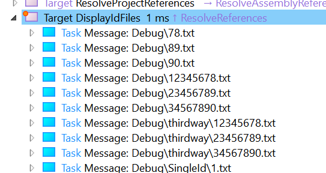

# msubild-tasks-demo

A small sample shows how to produce files dynamically in from one (vcxproj) project using an MSBuild task helper, and consume those files from another project as part of the same build.

## producer

This [project](producer\producer/producer.vcxproj) produces files.

- [producer\data.props](producer/data.props) contains data that's read by the targets.
  - This data is intended to be updated periodically, for example.
- [producers\Directory.Build.targets](producer/Directory.Build.Targets) contains various targets and an [inline MSBuild-task](https://docs.microsoft.com/en-us/visualstudio/msbuild/msbuild-inline-tasks?view=vs-2019)
  - The MSBuild `Task` aids in the generation of a file. This could be replaced with more complex logic, a different implementation style (for e.g., [non-inline](https://docs.microsoft.com/en-us/visualstudio/msbuild/task-writing?view=vs-2019)), multiple `Task`s etc.
    - The key to note here is that MSBuild can call a `Task` multiple times during a build, whereas Targets can usually be invoked only once (unless they're invoked as part of a build invocation with different parameters)
    - Also see [Customize your build](https://docs.microsoft.com/en-us/visualstudio/msbuild/customize-your-build?view=vs-2019) for info on how `Directory.build.targets` works. In general, for simple situations, *it just works*.
  - The `Targets` illustrate a few different ways in which the `Task` can be invoked, files can be written, [MSBuild batching](https://docs.microsoft.com/en-us/visualstudio/msbuild/msbuild-batching?view=vs-2019) can be performed, and so on.
    - This is by no means an exhaustive list - its just a starting point. There are many more ways this can be done - these examples are meant to help my team get started on a specific problem we're trying to solve, that's all.

## consumer

This [project](consumer/consumer.vcxproj) consumes the files produced by the `producer`

- [consumer.vcxproj](consumer/consumer.vcxproj) has a `ProjectReference` to [producer.vcxproj](producer/producer.vcxproj)
  - This `ProjectReference` does not actually reference the output-assembies (if any) that are generated by `producer`. See `ReferenceOutputAssembly` in [ProjectReference Protocol](https://github.com/dotnet/msbuild/blob/main/documentation/ProjectReference-Protocol.md)
  - Instead, it intentionally calls into `GenerateAllFiles` *Target* that was defined in [producer\Directory.Build.targets](producer/Directory.Build.Targets)
    - This call may not be needed, strictly speaking, because [producer/Directory.Build.targets](producer/Directory.Build.Targets) uses `InitialTargets` to ensure that `GenerateAllFiles` will always be run.
    - It also captures the output of the 'Target' that was just run by 'ProjectReference' into the *Item* named `ProducerOutputItems`
  - [consumer\Directory.Build.targets](consumer/Directory.Build.targets) has a target that shows the payload that was captured into `ProducerOutputItems`
    - Inspect the result of this target in a [binary log-viewer](https://msbuildlog.com) and you'll see something like this:

    